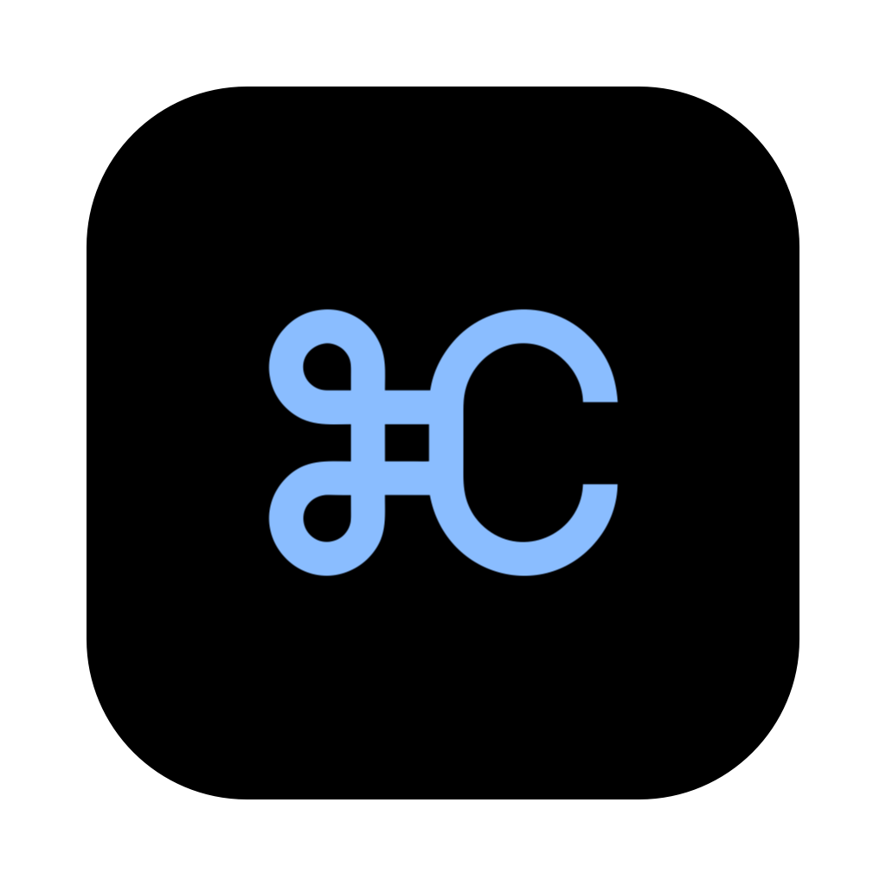
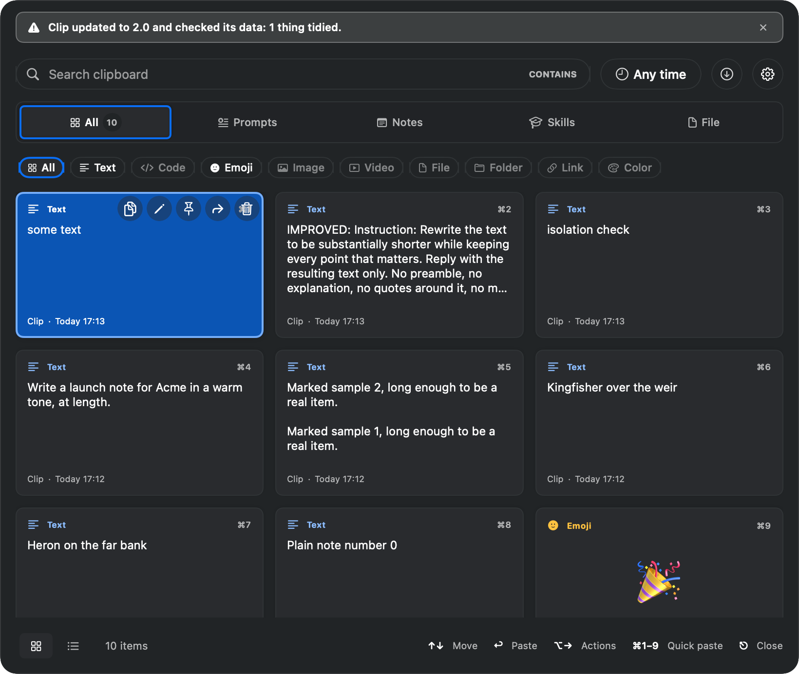

# Clip

**A clipboard manager for macOS.** Everything you copy, kept and searchable. A small library of text you reuse. AI that acts at the moment you paste — not in a separate tab.

Menu-bar only. No Dock icon. No account. Nothing leaves your Mac unless you choose sync.



[](https://github.com/shaulv/Clip/releases/latest)
[](https://github.com/shaulv/Clip/releases/latest)
[](LICENSE)
[](Clip/)

- macOS 14 or later · Apple Silicon and Intel
- No third-party dependencies — nothing is linked in but macOS itself
<!-- COUNTS:START (generated by docs/generate-counts.py - do not hand-edit) -->
**~51,433 lines of Swift** across 138 files, **2,062 behaviour-assertion call sites** in `qa-probe.py`, **47 security-check call sites** in `security-probe.py`.
<!-- COUNTS:END -->
- **19.9 MB** resident with a 745-item library · **216 ms** to launch

---

## Table of contents

- [Install](#install)
- [Features](#features)
  - [History — everything you copy](#history--everything-you-copy)
  - [Library — prompts, notes, skills, designs](#library--prompts-notes-skills-designs)
  - [Search](#search)
  - [Keyboard-first](#keyboard-first)
  - [Paste actions — AI on the way out](#paste-actions--ai-on-the-way-out)
  - [Themes](#themes)
  - [Sync](#sync)
  - [Privacy and security](#privacy-and-security)
- [Keyboard reference](#keyboard-reference)
- [Where things are](#where-things-are)
- [Building from source](#building-from-source)
- [Testing](#testing)
- [Self-hosting the sync server](#self-hosting-the-sync-server)
- [Contributing](#contributing)
- [Security](#security)
- [Licence](#licence)

---

## Install

### Download the DMG — fastest path

1. Download **[Clip-2.1.dmg](https://github.com/shaulv/Clip/releases/latest)** from the latest release.
2. Open the DMG and drag **Clip** onto **Applications**.
3. On first launch, macOS will say it cannot verify the developer.

   This is expected — Clip is free and open source, and Apple charges $99/year for the Developer ID that would suppress this warning. The warning fires for _every_ unnotarised app; it says nothing about whether the app is safe to run. Two ways past it, both one-time:

   - **Right-click** (or Control-click) Clip in Applications → **Open** → confirm in the dialog; or
   - In Terminal: `xattr -dr com.apple.quarantine /Applications/Clip.app`, then open normally.

4. Clip will ask for **Accessibility** permission — it needs this to register the global shortcut and to paste into other apps. It does not ask for anything else.

### Build from source

```bash
git clone https://github.com/shaulv/Clip.git
cd Clip
./build.sh            # builds and launches an unsigned Debug build
```

No package manager step, because there are no packages. Clip links nothing but macOS frameworks.

```bash
./build.sh xcode      # open in Xcode instead
./package.sh          # build a signed Release and a .dmg
./package.sh --install   # ...and install it to /Applications
```

> **The Xcode project is generated, not committed.** `regen-project.py` writes `Clip.xcodeproj/project.pbxproj` from the files on disk. Add a Swift file anywhere under `Clip/` and run it; there is no pbxproj to hand-edit. `build.sh` runs it for you.

See [CONTRIBUTING.md](CONTRIBUTING.md) for setup conventions and the full contributor guide.

---

## Features

### History — everything you copy


Clip monitors the macOS pasteboard continuously. Every time you copy, it stores the item and works out what **kind** of thing it is:

| Kind | What Clip does |
|---|---|
| **Plain text** | Stored as-is, syntax-highlighted if it detects code |
| **Code** | Language detected and shown in the card |
| **Rich text** | Stored with formatting |
| **Emoji** | Recognised and previewed large |
| **Image** | Thumbnail preview, palette extractable |
| **Video** | Stored and previewable |
| **File / Folder** | Stored; path recognised even when copied as text |
| **URL** | Page title fetched so the link reads as what it points at |
| **Colour** | Hex, RGB and HSL shown inline |
| **Service links** | Figma, GitHub, Slack, and ~12 others — opens in the native app |

**Confidential content is never recorded.** Password managers mark what they put on the pasteboard using `org.nspasteboard.ConcealedType`, `TransientType` and `AutoGeneratedType`. Clip honours all three by default, so it quietly skips your passwords.

**History is unlimited by default.** If you'd rather cap it, Settings → General → History has the control.

**Copying the same thing twice keeps only one copy.** Whether the repeat came from this Mac or arrived through sync, Clip deduplicates automatically.

---

### Library — prompts, notes, skills, designs

Five kinds of thing live side by side, each on its own tab:

| Tab | What it holds |
|---|---|
| **Clips** | Your history, newest first |
| **Prompts** | Text you reuse, with `{{variables}}` that are filled at paste time |
| **Notes** | Written in a full markdown editor |
| **Skills** | Markdown documents with YAML front matter, for AI tooling |
| **Designs** | `DESIGN.md` design systems — Clip can turn these into app themes |

Every tab is yours to customise: show, hide, reorder, and independently set the layout (list or gallery) and density of each one.

#### Prompts and variables

Write a prompt once — "Translate to {{language}}" — and Clip fills in the variable at paste time. Variable values are remembered per name, so the second use is usually just Return.

#### Compose-paste

Select several items across any tab, then paste them as one block.

---

### Search

Search runs over everything at once: title, tags, body, source app, and the date written the way you would say it.

```
"yesterday"    →  items from yesterday
"august"       →  items from August
"30/08"        →  items from 30 August
```

Three modes:

| Mode | Behaviour |
|---|---|
| **Contains** | Exact substring match |
| **Fuzzy** | Tolerates typos, partial words |
| **Regex** | Full regular expression |

Results are **ranked**, not merely filtered — the document actually about typography comes first when you search for "typography".

**Speed:** under 3 ms per keystroke against a 745-item library that includes 74 full design documents.

---

### Keyboard-first

Open Clip with **⌘⇧Space** (configurable). From there, the keyboard takes you everywhere:

- **Arrow keys** — move through the list
- **Return** — paste the selected item
- **⌥→** — open the action row for the selected item without lifting your hands
- **Per-item shortcuts** — any item can be given its own global shortcut, so the snippet you paste forty times a day is one keystroke away

The panel is an `NSPanel`, not an `NSPopover`, which is why hover actions are fully reachable from the keyboard. An earlier version used a popover and had six separate "broken" keyboard interactions that all traced to one architectural cause.

---

### Paste actions — AI on the way out

The clipboard is the only thing on your Mac that sees your work **in transit** — it knows both what you copied and where it's going. Clip's AI acts at that moment, not before and not after.

#### Quick translation — ⌃⌥T

Set two languages in Settings. One keystroke translates in whichever direction the text needs: Clip detects which of your two languages it is and gives you the other. No menu, no round trip.

#### Action menu — ⌃⌥A

Opens from **any app**, at the pointer, with no Clip panel on screen:

| Action | What it does |
|---|---|
| Translate | To any configured language |
| Rewrite in a style | Formal, casual, concise, and your own custom styles |
| Improve | Tightens and clarifies |
| Fix grammar | Corrects without rewriting |
| Shorten | Cuts to the essentials |
| Bullets | Restructures as a list |
| Summarise | One-paragraph summary |
| Explain error | Reads an error message and explains it plainly |
| Convert to JSON | Reformats structured text as JSON |
| Convert to TypeScript type | Generates a TypeScript interface or type |
| Convert to Swift struct | Generates a Swift struct |
| Write commit message | Reads a diff or description and writes a commit |
| Write reply | Drafts a response |
| Strip secrets | Removes API keys, tokens and passwords before sharing |
| Custom | Any instruction you write, in your own words |

**Rules that hold everywhere:**
- Nothing on the capture path ever calls a model — copying stays instant, offline and free
- A failed transform **pastes nothing** and leaves your clipboard exactly as it was
- The same two shortcuts work on a selected item while the panel is open

**Detail view actions:** nine more actions are available on a selected item — Improve, Proofread, Title, Tags, Summarise, Explain, Templatise, Translate, and Build a theme — each showing a diff before anything is written.

**Bring your own provider:** Anthropic, OpenAI, Gemini, Ollama (for local models), or any OpenAI-compatible endpoint. Keys live in the macOS Keychain. Multiple providers can be configured and given different roles.

---

### Themes

Twelve built-in themes, light and dark. Every theme is audited for contrast across **43 colour pairings** before it can be used — a palette that looks fine on a web page cannot ship as an unreadable list.

Three ways to build your own:

| Method | How |
|---|---|
| **Theme builder** | Pick colours directly; the builder shows live contrast results and flags any pairing that fails AAA |
| **From a design document** | A `DESIGN.md` with a `colors:` block in its front matter already is a theme. Clip reads it, maps the roles, and runs the 43-pairing audit. Of a 74-document corpus, 65 produce a passing theme; the 9 that cannot say so plainly. |
| **From a copied image** | Copy an image; Clip counts the pixels and extracts a palette |

---

### Sync

Three methods, one active at a time. Switching is deliberate.

| Method | What it requires |
|---|---|
| **Sign in with Google** | Nothing. _(Unavailable in this open-source build — see below)_ |
| **Your own server** | A PHP 8 host with MySQL. Clip generates the complete setup kit: code, config, and step-by-step instructions. Your data, your host. |
| **Export and import** | No server. Move a `.clipsync` file between Macs by hand. |

Settings, themes and tab arrangement sync too, on a cadence you choose: every minute, every hour, once a day, or on quit.

> **On the open-source build:** the upstream app's sync service address is deliberately stripped from this repository. Publishing it would mean every fork syncing strangers into somebody else's database. Google sign-in therefore reports itself as unavailable here; the other two methods work exactly as described. See [docs/SELF-HOSTING.md](docs/SELF-HOSTING.md) to run your own.

#### Combining two histories

When you connect a token on a new Mac, Clip asks whether to **combine** or **replace**, and shows you which way data will move before it moves. Combining does not duplicate: two items with the same content become one that keeps the most configured version — pinned if either was, a title over no title, tags pooled.

---

### Privacy and security

The short version: Clip stores everything you copy, in plain SQLite, on your Mac. That file is treated as the most sensitive thing on the machine.

- **Nothing leaves your Mac** unless you turn on sync — no telemetry, no crash reporting, no analytics, no update check
- **The store is owner-only** — `0600` on the database and its write-ahead log, `0700` on the directories; repaired on every launch
- **Confidential content is never recorded** — concealed, transient and auto-generated pasteboard markers are all honoured by default
- **Secrets live in the Keychain** — no API key, sync token or password reaches preferences, the settings-sync payload, the export file or the logs
- **No third-party code** — nothing to audit, nothing to be compromised upstream
- **The server trusts the token, not the caller** — every row is scoped to a space ID from the token; naming someone else's space reaches nothing
- **The QA bridge is compiled out of Release** — the file-driven harness that can drive the app and read its history exists only when `CLIP_TESTING` is defined; `package.sh` refuses to build a DMG if the symbol is found in the binary

Full threat model and evidence for each control: [SECURITY.md](SECURITY.md).

---

## Keyboard reference

| Shortcut | Action |
|---|---|
| **⌘⇧Space** | Open / close the panel (configurable) |
| **↑ ↓** | Move through the list |
| **Return** | Paste the selected item |
| **⌥→** | Open action row for selected item |
| **⌘F** | Focus search |
| **Esc** | Close panel / clear search |
| **⌘D** | Toggle pin on selected item |
| **⌘⌫** | Delete selected item (Undo available for 12 seconds) |
| **⌃⌥T** | Translate the clipboard (from any app) |
| **⌃⌥A** | Open the action menu (from any app) |
| **Custom** | Any item can have its own global shortcut |

---

## Where things are

```
Clip/
  Models/      ClipboardItem, ItemKind, ItemRole, ItemCategory, TimeFilter
  Core/        Capture, storage, sync, AI, shortcuts, the QA bridge
  Theme/       Themes, contrast rules, the audit, design-document parsing
  Views/       SwiftUI — the panel, cards, editors, every settings pane
ClipTests/     XCTest suite: hex, classify, contrast, migration, search, time
docs/          Self-hosting, Google sign-in, architecture notes
sync-server/       A Python stand-in used by the tests
sync-server-php/   The real server: PHP 8 + MySQL, no composer, no dependencies
```

For a deeper read: [ARCHITECTURE.md](ARCHITECTURE.md) explains how the pieces fit and why they are shaped the way they are.

New to the codebase, or pointing an AI assistant at it? [START-HERE.md](START-HERE.md) is written for exactly that.

---

## Building from source

```bash
# First build
git clone https://github.com/shaulv/Clip.git
cd Clip
./build.sh

# Open in Xcode
./build.sh xcode

# Build a signed Release DMG
./package.sh

# Build and install to /Applications
./package.sh --install
```

Run `python3 docs/generate-counts.py --write` after any change to the Swift tree or the probes — it recomputes the line and assertion counts in this README and rewrites them in place.

---

## Testing

Clip uses a file-based harness rather than a UI-test framework. The probe writes a command; the app performs it on the main thread exactly as a real event would; the app writes its observable state back out.

```bash
# Build the Testing configuration
xcodebuild -project Clip.xcodeproj -scheme Clip -configuration Testing \
  -derivedDataPath build-testing CODE_SIGNING_ALLOWED=NO build

# Start the app under the harness
CLIP_QA=1 CLIP_QA_SANDBOX=1 CLIP_HEADLESS=1 \
  ./build-testing/Build/Products/Testing/Clip.app/Contents/MacOS/Clip &

# Run the probes
python3 qa-probe.py          # behaviour assertions
python3 security-probe.py    # security checks
python3 perf-probe.py        # timings and counters
```

Three things to know before adding to the harness:

**It runs sandboxed.** `CLIP_QA_SANDBOX=1` moves the database, media folder, Keychain service _and_ preferences somewhere else. A test cannot damage the thing it is testing.

**The harness is not in the shipped app.** It is compiled out unless `CLIP_TESTING` is defined, which only the `Testing` configuration does. `package.sh` refuses to build a DMG if the symbol is found in the binary.

**Every assertion must be proved able to fail.** Run `python3 qa-probe.py --prove` (and `security-probe.py --prove`) — these run checks that _must_ fail and stop if they pass. If you add an assertion, break the code on purpose once and watch it go red.

The XCTest suite in `ClipTests/` covers hex parsing, the classify ladder, contrast and `ThemeRules` levels, search modes, the migration ladder, time buckets, item merging, file-reference paste, backup manifests, and settings identity.

---

## Self-hosting the sync server

`sync-server-php/` is a PHP 8 + MySQL service with no composer dependencies. It implements the same API as `sync-server/` (a Python stand-in used by the tests).

See [docs/SELF-HOSTING.md](docs/SELF-HOSTING.md) for the full setup walkthrough — it takes about fifteen minutes on any host with PHP 8 and MySQL.

```bash
# Run the server test suite against a local or live deployment
php sync-server-php/test-local.php http://localhost:8080/api
php sync-server-php/test-local.php https://yourdomain.com/api
```

```bash
# Verify no plaintext secrets are present before deploying
php sync-server-php/check-no-plaintext-secrets.php
```

---

## Contributing

[CONTRIBUTING.md](CONTRIBUTING.md) has the full setup guide, code conventions, and the one rule that matters most: **measure before you optimise, and prove every assertion can fail.**

Quick checklist before opening a PR:

1. Run `python3 qa-probe.py` — every assertion passes
2. Run `python3 security-probe.py` — every check passes
3. Run `python3 docs/generate-counts.py --write` — counts in the README are current
4. If you added a Swift file, run `python3 regen-project.py` — the project file is regenerated

---

## Security

To report a vulnerability, open a **private security advisory** on this repository rather than a public issue. Include what an attacker gains and the smallest reproduction you have. You will receive an acknowledgement, and credit unless you would rather not.

Full threat model, controls, and how to verify each one: [SECURITY.md](SECURITY.md).

---

## The mark

Clip's mark is **⌘C** — the shortcut the whole app is about — in `#8ABDFF` on black.

`brand/clip-mark.svg` is the trademark as drawn. `brand/clip-glyph.svg` is the glyph alone, on no background, which is what everything else is built from:

```bash
swift brand/make-icons.swift brand/clip-glyph.svg <output-dir>
```

---

## Licence

MIT. See [LICENSE](LICENSE).
